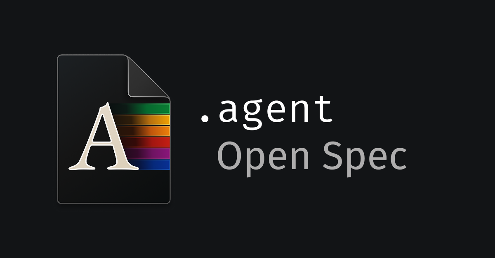

<p align="center">
  
</p>

# dot-agent

Monorepo for the dot-agent ecosystem — a language and runtime for building deterministic, composable AI agents.

---

## What is dot-agent?

Every agent is defined by two files:

```
agent.description  —  the manifest: identity, capabilities, data contracts
agent.behavior     —  the behavior: state machine, LLM orchestration, tool calls
```

The **Runtime** reads the manifest for sandboxing and discovery; it executes the behavior for orchestration. Agents are deterministic, composable, and portable across runtimes.

---

## Packages

| Package | Path | Description |
|---|---|---|
| `@dot-agent/tree-sitter` | [`packages/tree-sitter`](packages/tree-sitter) | Tree-sitter grammars for `.behavior` and `.description` |
| `@dot-agent/parser-dsl` | [`packages/parser-dsl`](packages/parser-dsl) | Rust/WASM parser — structured ASTs for compiler, LSP, and runtime |
| `@dot-agent/kernel-dsl` | [`packages/kernel-dsl`](packages/kernel-dsl) | Rust/WASM FSM execution engine |
| `@dot-agent/compiler` | [`packages/compiler`](packages/compiler) | Linter, semantic validation, ZIP packaging |
| `@dot-agent/language-server` | [`packages/language-server`](packages/language-server) | LSP server for IDE support |
| `@dot-agent/sdk` | [`packages/sdk`](packages/sdk) | Browser-compatible SDK for loading and running agent bundles |
| `@dot-agent/cli` | [`apps/dot-agent-cli`](apps/dot-agent-cli) | CLI for building, packaging, and running agents |
| `vscode-dot-agent` | [`apps/vscode-extension`](apps/vscode-extension) | VS Code extension: syntax highlighting, hover docs, LSP |

---

## Documentation

| Section | Contents |
|---|---|
| [`ROADMAP.md`](ROADMAP.md) | Language roadmap — current milestone, version policy, and feature maturity |
| [`dsl/`](dsl/) | Language reference — syntax, semantics, and design of `.description` and `.behavior` |
| [`docs/`](docs/) | Implementation reference — compiler APIs, kernel protocol, SDK, architecture |
| [`project/rfcs/`](project/rfcs/) | Public design proposals for new language and protocol features |
| [`project/tasks/`](project/tasks/) | Implementation tasks and technical debt tracking |
| [`examples/`](examples/) | Canonical annotated agent examples |

**Architecture overview:** [`docs/explanation/architecture/map.md`](docs/explanation/architecture/map.md)

---

## Development

```bash
# Install all workspace dependencies
npm install

# Build all packages
npm run build

# Run all tests
npm run test

# Build a specific package
npm run build --workspace=packages/compiler
```

**WASM packages** (`parser-dsl`, `kernel-dsl`) require Zig 0.13 and Rust with the `wasm32-wasip1` target. See each package's `scripts/build-wasm.sh`.

**Tree-sitter WASM** requires Docker (OrbStack) via `tree-sitter build --wasm`.

---

## Releases

Each package is released independently by pushing a tag:

```
git tag compiler@0.1.1 && git push origin compiler@0.1.1
```

Tag conventions: `<package>@<version>` — e.g. `tree-sitter@0.4.1`, `kernel-dsl@0.1.3`, `vscode@0.3.3`.

CI publishes automatically via the corresponding workflow in [`.github/workflows/`](.github/workflows/).

---

## License

Apache 2.0 — see [LICENSE](LICENSE).
