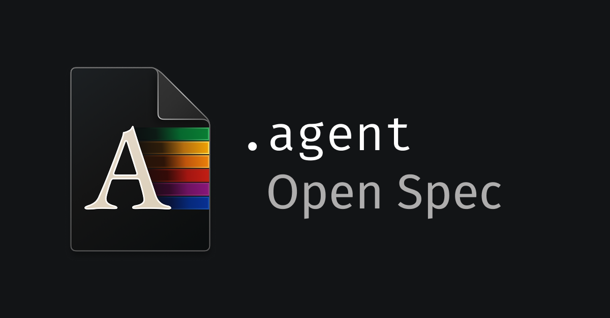

<p align="center">
  
</p>

<h1 align="center">dot-agent</h1>

<p align="center">
  <b>The universal file format for portable AI agents.</b><br>
  An open specification for writing, distributing and running autonomous agents across any host or
  model — one <code>.agent</code> file, readable by a human and executable by a machine.
</p>

<p align="center">
  <a href="https://www.npmjs.com/package/@dot-agent/cli"></a>
  <a href="https://marketplace.visualstudio.com/items?itemName=dot-agent.vscode-dot-agent"></a>
  <a href="LICENSE"></a>
</p>

<p align="center">
  <a href="#quickstart">Quickstart</a> ·
  <a href="dsl/">Language spec</a> ·
  <a href="#packages">Packages</a> ·
  <a href="docs/">Docs</a> ·
  <a href="ROADMAP.md">Roadmap</a> ·
  <a href="https://dot-agent.ai">dot-agent.ai</a>
</p>

---

An agent is two files. A `.description` declares the contract — what it needs, what it can do, what it
returns:

```
agent Text Assistant
  domain dot-agent.ai
  license Apache-2.0

description
Reviews and summarizes texts. Can adjust the tone and clarity of a text according to the objective, or generate a summary at different levels of detail.

behavior agent.behavior

capabilities
  ReviseAction "Reviews a text focusing on the tone and objective indicated by the user."
  SummarizeAction "Summarizes a text at the desired level of detail (executive, full, or bullet points)."

input
  string "The text to be reviewed or summarized"

output
  string "The revised or summarized text"
```

A `.behavior` declares the flow — a flat state machine, with the prompt held in `goal` and `guide` and
the routing held in `on intent`:

```
state init
  transition to responsive

state responsive
  goal "Initiate the interaction and identify whether the user wants their text summarized or revised"
  guide "Greet the user and ask them to share the text along with whether they'd like a summary or a tone/clarity revision. Be concise and maintain a helpful tone."
  interact
  on intent "summarize" transition to summary
  on intent "revise" transition to revise
  on intent "end" transition to goodbye
  on offtopic transition to responsive

state summary
  goal "Generate and present the summary"
  guide "Analyze the provided text to generate a clear, accurate summary at the level of detail requested (executive, full, or bullet points). Present the result and invite the user to provide a new text or conclude the session."
  teach "knowledge/maintopics.md"
  interact
  on intent "new_text" transition to responsive
  on intent "end" transition to goodbye
  on offtopic transition to responsive
```

*(Both files, complete and runnable, in [`examples/1. Text Summary`](<examples/1. Text Summary>).)*

Everything a machine can guarantee — which states exist, which transitions are legal, which capabilities
may be called — is checked before the model is ever asked anything. Everything only a model can infer
stays in the prose.

## Why

Building an agent on one platform locks it to that platform. Every vendor has its own prompt schema, its
own tool-calling convention, its own governance model, so porting an agent means rewriting it — and
running the same agent on-device and in the cloud means writing it twice. The result is M×N integrations:
bespoke glue for every combination of framework and runtime.

`.agent` proposes the separation that Docker made for software distribution: decouple the agent from the
runtime that executes it. The behavior is authored once, in a text format a reviewer can read in a diff,
and any conforming runtime can execute it.

## Quickstart

```bash
npm install -g @dot-agent/cli
```

```console
$ mkdir my-agent && cd my-agent
$ dot-agent init --name my-agent --domain example.com
✓ Scaffolded agent project in /tmp/my-agent
  Files: LICENSE, README.md, SOUL.md, agent.behavior, agent.description,
         behaviors/.gitkeep, guides/.gitkeep, knowledge/.gitkeep

$ dot-agent pack --dir . --out my-agent.agent
✓ Packed → my-agent.agent
  ID: example.com/my-agent
  Warnings: 1
⚠ agent.description:2:10 W003 domain still has default value "example.com"
```

`pack` lints before it writes, so a broken agent fails at authoring time rather than at run time. The
result is a single portable `.agent` file; `dot-agent run my-agent.agent` loads it and starts its state
machine, and `dot-agent unpack` turns it back into editable sources.

Full command surface: [`apps/dot-agent-cli`](apps/dot-agent-cli).

### In an editor

The [VS Code extension](https://marketplace.visualstudio.com/items?itemName=dot-agent.vscode-dot-agent)
adds syntax highlighting, hover documentation and live diagnostics for both file types, backed by the
same linter the CLI runs.

### In Claude Code

```bash
claude plugin marketplace add dot-agent-spec/platform
claude plugin install dot-agent@dot-agent-spec
```

This registers the `/dot-agent:run` and `/dot-agent:test` skills and the `dot-agent` MCP servers, so
Claude Code can author an agent and then execute its state machine. `dot-agent configure --claude` runs
the same two commands for you. See [`plugins/claude`](plugins/claude).

> The DSL is `0.x`. It is usable today, and the grammar may still change before the v1.0 freeze — the
> current milestone and what is committed to it are in [`ROADMAP.md`](ROADMAP.md).

## Packages

| Package | Path | Description |
|---|---|---|
| `@dot-agent/cli` | [`apps/dot-agent-cli`](apps/dot-agent-cli) | CLI for scaffolding, packaging and running agents |
| `@dot-agent/compiler` | [`packages/compiler`](packages/compiler) | Linter, semantic validation, `.agent` packaging |
| `@dot-agent/sdk` | [`packages/sdk`](packages/sdk) | Browser-compatible SDK for loading and running agent bundles |
| `@dot-agent/kernel-dsl` | [`packages/kernel-dsl`](packages/kernel-dsl) | Rust/WASM FSM execution engine |
| `@dot-agent/parser-dsl` | [`packages/parser-dsl`](packages/parser-dsl) | Rust/WASM parser — structured ASTs for compiler, LSP and runtime |
| `@dot-agent/tree-sitter` | [`packages/tree-sitter`](packages/tree-sitter) | Tree-sitter grammars for `.behavior` and `.description` |
| `@dot-agent/language-server` | [`packages/language-server`](packages/language-server) | LSP server for IDE support |
| `vscode-dot-agent` | [`apps/vscode-extension`](apps/vscode-extension) | VS Code extension: highlighting, hover docs, LSP client |
| `dot-agent` (Claude Code plugin) | [`plugins/claude`](plugins/claude) | Native Claude Code plugin — MCP runtime, dev tooling, authoring helper |

Each has its own README covering its API and its own usage.

## Requirements

Node.js 24 or newer to run the CLI. Nothing else — the parser and the execution kernel ship as WASM.

## Learn more

The [language reference](dsl/) defines `.description` and `.behavior`; the
[implementation docs](docs/) cover the compiler API, the kernel protocol and the SDK, starting from the
[architecture map](docs/explanation/architecture/map.md). Annotated agents live in
[`examples/`](examples/), and [`ROADMAP.md`](ROADMAP.md) states the current milestone and the version
policy.

To contribute, read [CONTRIBUTING.md](CONTRIBUTING.md) for the toolchain and build, and
[GOVERNANCE.md](GOVERNANCE.md) for how language changes are proposed and decided.

## License

Apache 2.0 — see [LICENSE](LICENSE).

Copyright is held collectively by **The dot-agent Authors**, listed in [AUTHORS](AUTHORS). Contributors
keep copyright over their own work; there is no copyright assignment. Source files carry only
`// SPDX-License-Identifier: Apache-2.0` — see [CONTRIBUTING.md](CONTRIBUTING.md#licensing-and-attribution)
before your first pull request.
