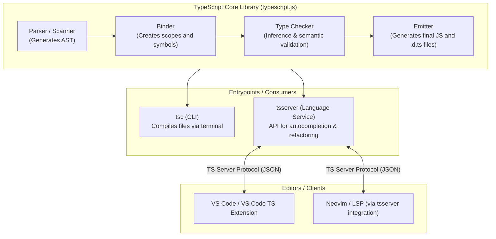
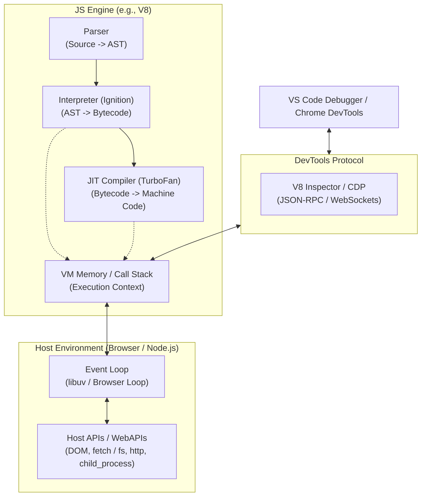
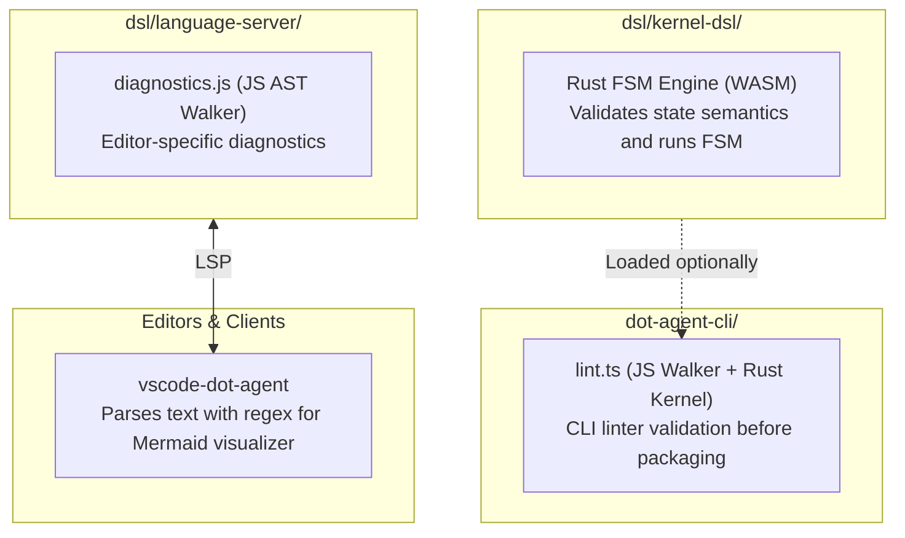
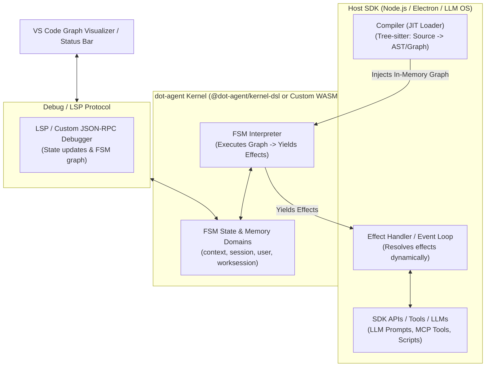

# Architecture & Execution Comparison: JS/TS vs. dot-agent DSL

This document provides a comparative analysis of the compilation and runtime execution architectures of JavaScript/TypeScript vs. the **dot-agent** DSL ecosystem.

---

## 1. TypeScript Architecture (Compilation-Only Reference)

In TypeScript, all compiler logic, parsing, type checking, and emitter functionality resides in a single core package (`typescript`). Both the CLI tool (`tsc`) and the IDE Language Service (`tsserver`) consume this shared package, ensuring 100% identical diagnostics.

---

## 2. JavaScript Execution Runtime Architecture (Node.js & Browsers)

Because TypeScript is compilation-only (it does not execute code), we must look at how the JavaScript runtime (e.g., V8) manages execution. 

A JS engine compiles and executes source code, interacting with a **Host Environment** (Node.js or Browser) that provides external APIs (DOM, filesystem) via an event loop, and exposes a debugging protocol (Chrome DevTools Protocol) to IDEs.

---

## 3. dot-agent DSL Architecture (Current State)

Currently, compiler validation and linter checks are fragmented across different packages. The Language Server and the CLI maintain separate linting implementations. Additionally, the VS Code client contains custom regex-based parsing to draw graphs.

---

## 4. dot-agent DSL Proposed Runtime Architecture

To match the clean separation of JS/TS architectures, the dot-agent ecosystem splits execution into:
1. **The Host SDK (`@dot-agent/sdk`)**: Functions as the host environment and orchestrator. It uses the compiler to Just-In-Time (JIT) parse the `.behavior` text into an execution graph, injects it into the kernel, and resolves the effects emitted by the kernel (invoking LLMs, running scripts, calling MCP tools). It also supports **Pluggable Kernels** if a package ships with a custom `.wasm`.
2. **The VM/Kernel (`@dot-agent/kernel-dsl`)**: Functions as the engine. It is a "blind" execution environment that receives the pre-parsed FSM structure. It tracks memory scopes (`context`, `session`, etc.), manages the active FSM state, and yields deterministic side-effects (**Effects**).
3. **The LSP Debugger Protocol**: Allows IDE tools to inspect memory state and FSM graphs without reinventing the parser.

---

## 5. Summary of Analogies

| JavaScript Ecosystem Component | dot-agent DSL Ecosystem Component | Purpose |
|:---|:---|:---|
| **V8 Engine (Ignition/TurboFan)** | `@dot-agent/kernel-dsl` (Rust FSM Engine) | The core virtual machine. Executes the pre-parsed FSM logic, manages execution memory, and evaluates logic state. Can be swapped with custom `.wasm` kernels. |
| **Node.js/Browser Host APIs** (DOM, `fs`, `fetch`) | **Host SDK / LLM OS** (Orchestrator) | The surrounding execution environment. Performs the JIT compile, does actual I/O, runs LLM turns, calls MCP tools, and runs script tasks. |
| **JS Event Loop** (libuv) | **Effect Handler / Loop** | Listens for completion of async operations (e.g. script finished, LLM response ready) and feeds the event back into the FSM engine. |
| **Chrome DevTools Protocol (CDP)** | **LSP / Custom Debug JSON-RPC** | Protocol enabling IDE extensions to inspect FSM states, look up memory, and pull graph structural metadata. |
| **TypeScript Compiler (`tsc`)** | `dot-agent pack` (CLI validation core) | Builds, type-checks, and bundles resources (`agent.description` + `agent.behavior` + custom files) into a final `.agent` ZIP package. |
| **TypeScript Language Server (`tsserver`)**| `@dot-agent/language-server` | IDE bridge providing lint errors, completions, definition navigation, and live debugging info. |
