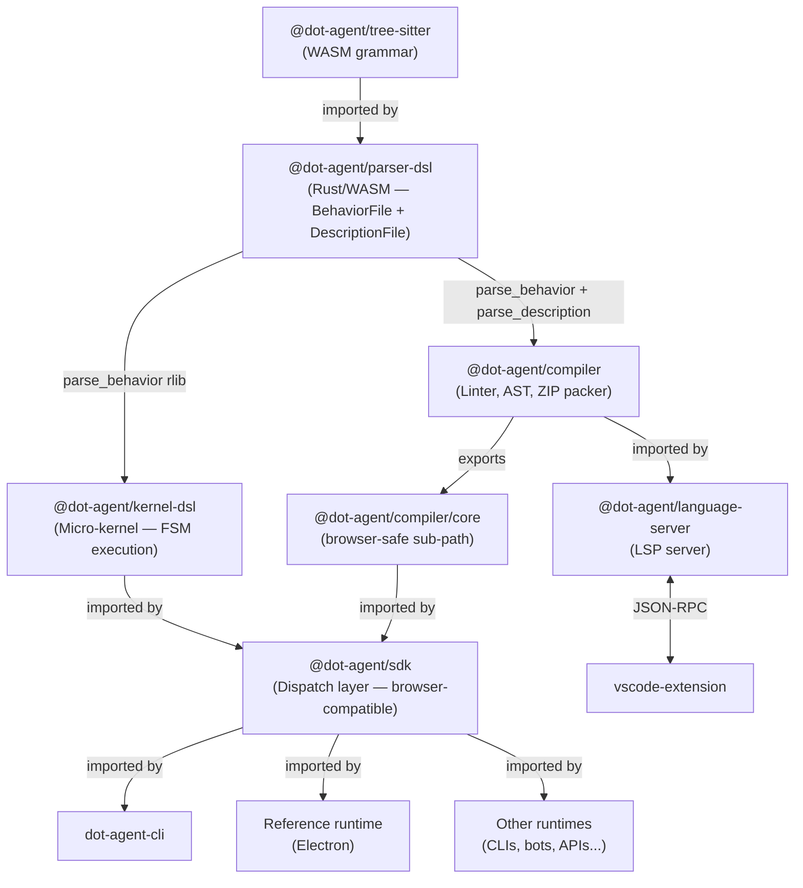
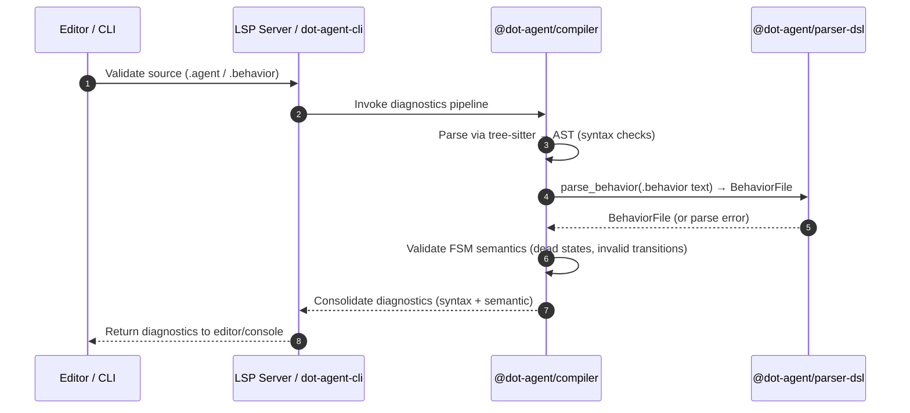
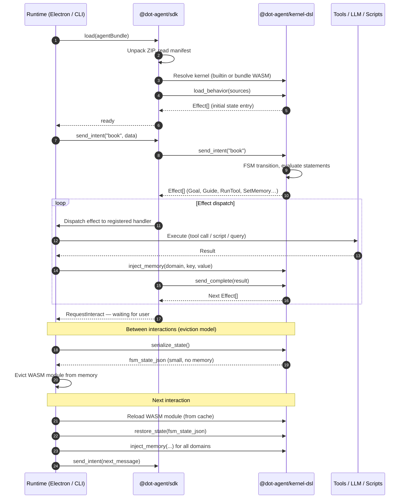

<!--
 Copyright (c) 2026 Danilo Borges (https://github.com/daniloborges)

 Licensed under the Apache License, Version 2.0 (the "License");
 you may not use this file except in compliance with the License.
 You may obtain a copy of the License at

 https://www.apache.org/licenses/LICENSE-2.0
-->

# dot-agent Architecture Map

> Sections marked **⚠️ aspirational** describe components not yet implemented.

---

## View 1: Monorepo Directory Structure

```
dot-agent/ (Monorepo Root)
├── README.md
├── AGENTS.md                  # Repo guide for AI collaborators
├── ROADMAP.md                 # Language roadmap, version policy, freeze/editions
├── GOVERNANCE.md              # Decision process (RFC / ADR / task)
├── project/                   # PM: decisions, proposals, tasks
│   ├── templates/             # rfc / adr / task templates
│   ├── adr/                   # architecture decision records
│   ├── pre-release/           # pre-v1.0 incubation logs (DA scheme)
│   ├── rfcs/                  # public design proposals
│   └── tasks/                 # implementation tasks and technical debt
├── dsl/                       # language spec (Diátaxis)
│   ├── reference/             # syntax: .behavior, .description, types, memory
│   ├── explanation/           # design: principles, scope, behavior vs WASM
│   ├── how-to/
│   └── tutorials/
├── examples/                  # Canonical annotated .agent + .behavior pairs (CI-tested)
├── docs/                      # Diátaxis documentation
│   ├── tutorials/
│   ├── how-to/
│   ├── reference/
│   └── explanation/
├── packages/
│   ├── tree-sitter/           # WASM grammar — syntax only (submodule)
│   ├── parser-dsl/            # Rust/WASM — unified parser for .behavior + .description
│   ├── kernel-dsl/            # Micro-kernel: executes BehaviorFile, emits Effects
│   ├── compiler/              # Linter, AST analysis, semantic validation, ZIP packaging
│   ├── sdk/                   # Browser-compatible dispatch layer — loads .agent, runs kernel
│   ├── language-server/       # LSP server (uses compiler; does not use kernel)
│   ├── transpiler-core/       # ⚠️ Types/interface — TranspileInput, Transpiler<TGraph>, CodeEmitter<TGraph>
│   ├── transpiler-langgraph/  # ⚠️ Codegen: .agent → LangGraph Python StateGraph
│   └── transpiler-appintent/  # ⚠️ Codegen: .agent → Swift AppIntent
└── apps/
    ├── dot-agent-cli/         # Developer CLI (submodule) — outdated, pending update
    ├── vscode-extension/      # VS Code LSP client (submodule) — outdated, pending update
    ├── agy/                   # Antigravity CLI runtime plugin (submodule)
    └── zed-agent/             # FROZEN — kept for historical reference only
```

---

## View 2: Package Dependency Hierarchy



### Layer breakdown (bottom-up)

| Layer | Package | Responsibility | Status |
|---|---|---|---|
| 0 | `@dot-agent/tree-sitter` | WASM grammar — syntax only, no logic | ✅ |
| 1 | `@dot-agent/parser-dsl` | **Shared** — parses `.behavior` → `BehaviorFile` and `.description` → `DescriptionFile` (Rust/WASM). Compiler reads both; kernel links as `rlib` for `BehaviorFile` only. Compiler uses `DescriptionFile` to populate `aboutme.json` and generate `types.json`. | ✅ |
| 2a | `@dot-agent/compiler` | Syntactic linting (JS tree-sitter), semantic validation, addon validation, `.agent` ZIP packaging | ✅ |
| 2b | `@dot-agent/kernel-dsl` | Micro-kernel — loads `BehaviorFile`, executes FSM, emits `Effect[]`. Does not store memory. | ✅ |
| 3 | `@dot-agent/language-server` | LSP server — delegates diagnostics to compiler. Does not use the kernel. | ✅ |
| 4 | `@dot-agent/sdk` | Dispatch layer — loads `.agent` bundles (accepts `Uint8Array`), initializes kernel, dispatches effects to registered handlers. 100% browser-compatible: imports only `@dot-agent/compiler/core` (no `fs/promises`). | ✅ |
| 5 | apps / runtimes | Register effect handlers; own memory storage; orchestrate multi-agent scenarios | ⚠️ pending update |

**No circular dependencies.** `compiler` and `kernel-dsl` do not import each other — both converge at the `sdk`.

---

## View 3: Compilation and Static Analysis Pipeline

Both the LSP Server (editor interface) and the CLI (terminal interface) share the same diagnostics pipeline via `@dot-agent/compiler`, ensuring identical developer feedback in both environments.



---

## View 4: SDK as a Lean Dispatch Layer

The SDK does not orchestrate multiple agents, generate adapters, or manage memory. It is a minimal dispatch layer: loads a `.agent` bundle from bytes, initializes the kernel, and routes effects to registered handlers.

```typescript
import { loadAgent, AgentSession } from '@dot-agent/sdk'

// accepts Uint8Array from fetch(), File API, or fs.readFile() — caller provides bytes
const bundle = await loadAgent(bytes)
const session = await AgentSession.create(bundle)

session.registerHandler('goal',            e => llm.setContext(e.text))
session.registerHandler('request_interact', () => ui.awaitUserInput())
session.registerHandler('run_tool',        e => tools.call(e.target))

session.start()  // fires initial state effects

// later, on user input:
session.sendIntent('next')
```

### Memory ownership model

The runtime owns the canonical memory store. Flow on every `SetMemory` effect:

```
kernel emits: SetMemory { domain: "session", key: "city", value: "São Paulo" }
  → SDK dispatches to runtime's SetMemory handler
  → runtime stores value canonically
  → runtime applies permission check
  → runtime calls kernel.inject_memory("session", "city", "São Paulo")
  → kernel updates its read-only view (used for `if` condition evaluation only)
```

---

## View 5: Runtime Execution Sequence



---

## View 6: Effect Types

Effects are the kernel's only output channel. The SDK dispatches each one to the registered handler.

| Effect | Fields | Handler responsibility |
|---|---|---|
| `Goal` | `text` | Pass to LLM context |
| `Guide` | `text` | Pass to LLM or display |
| `Teach` | `text` | Load teaching file |
| `RequestInteract` | — | Await user input |
| `Transition` | `from`, `to` | Update UI state |
| `RunTool` | `target`, `label?` | Call external tool |
| `RunScript` | `target`, `label?`, `silent` | Execute script |
| `RunSubagent` | `target`, `label?`, `background` | Runtime orchestrates |
| `SetMemory` | `domain`, `key`, `value` | Store + inject back into kernel |
| `ApplyCss` / `RemoveCss` | `value` | DOM styling |
| `ParseError` | `message` | Surface diagnostic |

---

## Implementation Status

| Component | Status | Location / Notes |
|---|---|---|
| `@dot-agent/tree-sitter` | ✅ Done | `packages/tree-sitter/` (submodule) |
| `@dot-agent/parser-dsl` | ✅ Done | `packages/parser-dsl/` (Rust/WASM) |
| `@dot-agent/kernel-dsl` | ✅ Done | `packages/kernel-dsl/` (Rust/WASM) |
| `@dot-agent/compiler` | ✅ Done | `packages/compiler/` (TypeScript) |
| `@dot-agent/language-server` | ✅ Done | `packages/language-server/` |
| `@dot-agent/sdk` | ✅ Done | `packages/sdk/` — browser-compatible, accepts `Uint8Array`, reads `.agent/files.json` for flexible filenames |
| `@dot-agent/transpiler-core` | ⚠️ Aspirational | `packages/transpiler-core/` — types/interface only; see RFC-0018 |
| `@dot-agent/transpiler-langgraph` | ⚠️ Aspirational | `packages/transpiler-langgraph/` — codegen target; see RFC-0018 |
| `@dot-agent/transpiler-appintent` | ⚠️ Aspirational | `packages/transpiler-appintent/` — codegen target; see RFC-0018 |
| `dot-agent-cli` | ⚠️ Outdated | `apps/dot-agent-cli/` (submodule) — pending update to v2 architecture |
| `vscode-extension` | ⚠️ Outdated | `apps/vscode-extension/` (submodule) — pending update to v2 architecture |
| `agy` | 🚧 In Progress | `apps/agy/` (submodule) — Antigravity CLI plugin |
| `zed-agent` | 🧊 Frozen | `apps/zed-agent/` — historical reference only |
| RFCs 0001–0004 | 📝 Draft | `rfcs/` — specs in progress, not reflected in this map |
