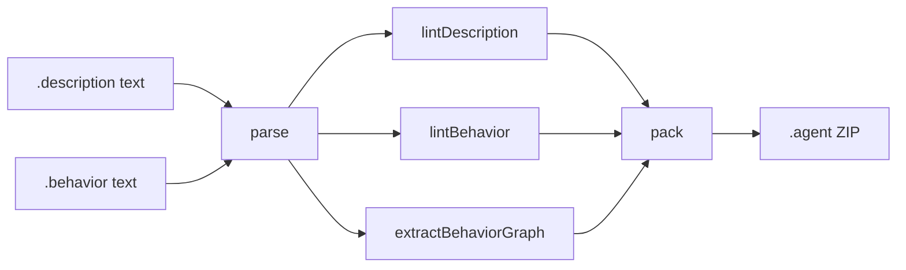

# Compiler Pipeline

This document explains how `@dot-agent/compiler` processes a dot-agent source tree from raw text to a packaged `.agent` bundle.

---

## Overview



The pipeline has four layers:

1. **Parse** — convert source text into a tree-sitter syntax tree
2. **Lint** — walk the tree and emit `LintMessage` diagnostics
3. **Graph** — extract the FSM state/transition graph from a behavior tree
4. **Pack** — orchestrate lint + hash + ZIP into a distributable bundle

---

## Layer 1 — Parse (`src/parser.ts`)

`initParsers()` loads two WASM grammars from `@dot-agent/tree-sitter`:

- **description grammar** — parses `.description` files (agent metadata, capability declarations, I/O types)
- **behavior grammar** — parses `.behavior` files (FSM states, transitions, intent handlers)

After initialisation, `parse(langId, text)` is async and returns a `Tree`. `parseSync` is available once parsers are initialised (used internally for merge-resolution during behavior linting).

**Incremental parsing**: `parse(langId, text, previousTree)` accepts an old `Tree`. To get full incremental benefits the caller must call `tree.edit(edit)` on the previous tree before passing it — otherwise tree-sitter falls back to a full re-parse.

---

## Layer 2 — Lint (`src/linter.ts`)

### Description linting — `lintDescription(text, file?)`

1. Collect syntax errors via `collectSyntaxErrors` — walks the tree looking for `ERROR` and `MISSING` nodes, emitting `E004` with a human-readable hint when possible.
2. **W003** — check `agent_meta` nodes for the default `domain` value `"example.com"`.
3. **W004** — check `type_reference` nodes inside `input`/`output`/`requires`/`capabilities` blocks against declared `type_decl` names.

### Behavior linting — `lintBehavior(text, file?, docPath?)`

1. **E004 / MISSING hints** — same syntax-error walk as description.
2. **E008** — detect oriented states (those with `interact`) that are missing a required `goal` statement.
3. **W002** — check `goal_stmt` and `guide_stmt` quoted strings; warn if content exceeds 280 characters.
4. **E005 / W005** — dangling transitions: walk all `transition_stmt` nodes and check that the target state is defined. Dotted names (e.g. `other.behavior.state`) produce W005 (external reference assumed); plain names produce E005.
5. **W006** — detect `interact` nodes whose enclosing state has no `intent_handler` or `offtopic_handler`.
6. **E006 / W001** — if `@dot-agent/kernel-dsl` is available, load the behavior into the FSM engine and report any semantic errors (dead states, parse failures).

`docPath` enables multi-file merge resolution: when a `.behavior` file uses `merge "path/to/other.behavior"`, the linter reads the merged files to collect their state names before checking dangling transitions.

---

## Layer 3 — Graph extraction (`src/graph.ts`)

`extractBehaviorGraph(tree)` produces a `BehaviorGraph`:

```ts
{
  states: string[]                                // all state names
  transitions: { from: string; to: string }[]    // deduplicated edges
  entryPoints: { event: string; to: string }[]   // top-level `on event` triggers
}
```

It is used by the language server to render the Mermaid flow-graph panel and by the pack pipeline to validate connectivity.

---

## Layer 4 — Pack (`src/pack.ts`)

`pack(options)` runs the full pipeline for a directory:

```
collectFiles(dir)
  → lintDescription + lintBehavior   (abort on any error)
  → SHA-256 hash of description + behavior sources
  → buildAboutme (name, domain, version, integrity)
  → JSZip: source files + .agent/aboutme.json + .agent/files.json
  → write ZIP to disk
  → return PackResult { id, path, warnings }
```

The resulting `.agent` ZIP is self-describing: `aboutme.json` contains the agent ID, schema version, and SHA-256 integrity digest; `files.json` maps logical roles (`description`, `behavior`) to their paths inside the archive.

---

## Why two WASM dependencies?

`@dot-agent/tree-sitter` provides syntactic grammars — it knows the *shape* of valid source text but nothing about FSM semantics (e.g., whether a transition target is defined).

`@dot-agent/kernel-dsl` is the Rust/WASM FSM engine — it validates *semantic* correctness by actually executing the state machine definition. The compiler calls `kernel.load_behavior(text)` and inspects the returned effects for `parse_error` entries and uses `kernel.get_graph()` to check for isolated states.

Keeping them separate lets the compiler degrade gracefully: if the kernel is unavailable (some environments block WASM threads), syntactic checks still run.
