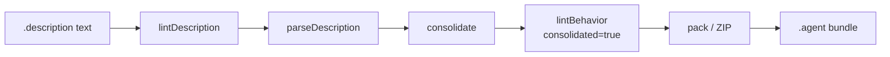

# Compiler Pipeline

This document explains how `@dot-agent/compiler` processes a dot-agent source tree from raw text to a packaged `.agent` bundle.

---

## Overview


```mermaid
graph LR
    A[".description text"] --> B[lintDescription]
    B --> C[parseDescription]
    C --> D[consolidate]
    D --> E[lintBehavior\nconsolidated=true]
    E --> F[pack / ZIP]
    F --> G[".agent bundle"]
```

The pipeline has four layers:

1. **Parse** — convert source text into a tree-sitter syntax tree or Rust WASM AST
2. **Lint** — walk the tree and emit `LintMessage` diagnostics
3. **Consolidate** — recursively merge all `.behavior` files into a single canonical text
4. **Pack** — orchestrate lint + consolidation + hash + ZIP into a distributable bundle

---

## Layer 1 — Parse (`src/parser.ts`)

`initParsers()` loads two WASM grammars from `@dot-agent/tree-sitter`:

- **description grammar** — parses `.description` files (agent metadata, capability declarations, I/O types)
- **behavior grammar** — parses `.behavior` files (FSM states, transitions, intent handlers)

After initialisation, `parse(langId, text)` is async and returns a `Tree`. `parseSync` is available once parsers are initialised (used internally for merge-resolution during behavior linting).

**Incremental parsing**: `parse(langId, text, previousTree)` accepts an old `Tree`. To get full incremental benefits the caller must call `tree.edit(edit)` on the previous tree before passing it — otherwise tree-sitter falls back to a full re-parse.

---

## Layer 2 — Lint (`src/linter.ts`)

### Description linting — `lintDescription(text, file?)`

1. Collect syntax errors via `collectSyntaxErrors` — walks the tree looking for `ERROR` and `MISSING` nodes, emitting `E004` with a human-readable hint when possible.
2. **W003** — check `agent_meta` nodes for the default `domain` value `"example.com"`.
3. **W004** — check `type_reference` nodes inside `input`/`output`/`requires`/`capabilities` blocks against declared `type_decl` names.

### Behavior linting — `lintBehavior(text, file?, docPath?)`

1. **E004 / MISSING hints** — same syntax-error walk as description.
2. **E008** — detect oriented states (those with `interact`) that are missing a required `goal` statement.
3. **W002** — check `goal_stmt` and `guide_stmt` quoted strings; warn if content exceeds 280 characters.
4. **E005 / W005** — dangling transitions: walk all `transition_stmt` nodes and check that the target state is defined. Dotted names (e.g. `other.behavior.state`) produce W005 (external reference assumed); plain names produce E005.
5. **W006** — detect `interact` nodes whose enclosing state has no `intent_handler` or `offtopic_handler`.
6. **E006 / W001** — if `@dot-agent/kernel-dsl` is available, load the behavior into the FSM engine and report any semantic errors (dead states, parse failures).

`docPath` enables multi-file merge resolution: when a `.behavior` file uses `merge "path/to/other.behavior"`, the linter reads the merged files to collect their state names before checking dangling transitions.

---

## Layer 3 — Graph extraction (`src/graph.ts`)

`extractBehaviorGraph(tree)` produces a `BehaviorGraph`:

```ts
{
  states: string[]                                // all state names
  transitions: { from: string; to: string }[]    // deduplicated edges
  entryPoints: { event: string; to: string }[]   // top-level `on event` triggers
}
```

It is used by the language server to render the Mermaid flow-graph panel and by the pack pipeline to validate connectivity.

---

## Layer 4 — Pack (`src/pack.ts`)

`pack(options)` runs the full pipeline for a directory in seven steps:

```
1. discoverDescriptionFile(dir, options.description?)
      → fail E003 if 0 or 2+ .description files found
2. lintDescription(text)
      → fail fast on errors (E017, E004, …) before WASM init
3. initBehaviorParser() + parseDescriptionFile(text)
      → fail E_DESC if behavior block absent or path escapes root (E014)
4. consolidate(dir, df.behavior)
      → DFS merge graph, topological order (leaves first, entry last)
      → E012 (file not found), E013 (cycle), E014 (external path)
5. lintBehavior(mergedText, consolidated=true)
      → E015 (duplicate state across files), E016 (no init state), W014 (duplicate trigger)
      → fail on errors
6. collectFiles(dir, descriptionFile, mergedText, mergeSources)
      → description file, agent.behavior (consolidated), behaviors/<relpath> sources,
         SOUL.md, and every file named by a guide/teach statement (E018 if missing)
7. findOrphanContentFiles(dir, mergedText)
      → W015 for files in guides//knowledge/ that no statement references
8. hash + buildAboutme + JSZip → write .agent bundle
```

### Path safety and the trust boundary

Every path-bearing statement — `merge`, `behavior <path>` in the `.description`, `persona`, `guide`,
`teach` — is resolved against the agent root and rejected if it escapes, as `E014`. The reason is that a
bundle is distributed: a relative path climbing out of the root (`merge "../../projects/secret"`) would
carry the author's filesystem structure, and their file contents, to whoever installs the agent. A
behavior file written by an LLM can produce one of those innocuously, or under prompt injection.

Consolidation is what makes the check sufficient. The rejected alternative was to bundle sources at their
original relative depth and rewrite `merge` paths inside them, which needs a Rust-side `.behavior`
serializer — an AST round-trip that has to keep pace with every grammar change. Flattening the graph at
compile time removes both the writer and the runtime path resolution: the kernel receives one validated
AST with no external references left to resolve.

**Symlinks are followed, and that is a deliberate boundary rather than an oversight.** A symlink inside
the agent root pointing at a shared file elsewhere is the sanctioned way to reuse one behavior file across
projects, so the compiler resolves it and bundles the content. The bundle key is always the merge
declaration path relative to the agent root — never the link target's absolute path — so the reuse leaks
no filesystem structure. What it does mean is that a symlink is the one path form the platform does not
police:

| Threat | Caught by | Whose responsibility |
|---|---|---|
| `merge "../../.env"` — relative escape | `E014`, at compile time | the platform |
| `merge "/etc/passwd"` — absolute path | `E014`, at compile time | the platform |
| Any file that is not valid `.behavior` syntax | `E004`, at compile time | the platform |
| A symlink inside the root resolving outside it | nothing — allowed by design | **the agent author** |
| A file hand-crafted to be both secret and valid `.behavior` syntax | nothing | **the agent author** |

The last two rows are the trust boundary: format validation is the security layer, and an author who
points a symlink at something private has expressed intent the compiler cannot distinguish from
legitimate reuse.

### What gets bundled: the linked-only rule

Content files are **not** swept out of `guides/` and `knowledge/`. A file ships only when a
`guide "guides/x.md"` or `teach "knowledge/x.txt"` statement names it, so the bundle is a function of
the behavior graph rather than of whatever happens to sit in the directory. A reference is a path
relative to the agent root, resolved literally and bundled verbatim at that same path — the namespace
comes from the path, not the keyword. A reference that resolves to no file is `E018`; a file that no
reference names is `W015`; a reference that resolves outside `guides/`/`knowledge/` is `W016`
(bundled, but unreachable — only those two prefixes are served at runtime).

The rule exists because an unreferenced content file is unreachable at runtime anyway: the kernel's
`teach` effect hands the host the reference path, and the MCP server exposes `dot-agent://knowledge/{+name}`
with no listing endpoint, so nothing can discover a path the behavior never mentions.

### Bundle structure

```
.agent/
  aboutme.json       — agent ID, schema, integrity hash
  files.json         — maps { description, behavior, behaviors[], guides[], knowledge[] }
<descriptionFile>    — e.g. analyst.description
agent.behavior       — consolidated output (all merges flattened, always this name)
behaviors/           — source files from merge chain (behaviors/main.behavior, behaviors/shared.behavior, …)
SOUL.md              — persona (optional)
guides/              — files named by a `guide` statement (optional)
knowledge/           — files named by a `teach` statement (optional)
```

`agent.behavior` is always the canonical consolidated name regardless of what the entry file is called. `files.json.behaviors` lists the merge-chain source paths for reference.

The kernel resolves `merge` too — `flatten_merges` in `kernel-dsl/src/engine/mod.rs`, reached through
`load_behavior_with_bundle`. That is not dead code left behind by consolidation: it is the path taken in
**dev mode**, where source files are loaded directly without packing. A compiled bundle never uses it,
because `agent.behavior` arrives with no `merge` statements left to resolve.

The resulting `.agent` ZIP is self-describing: `aboutme.json` contains the agent ID, schema version, and SHA-256 integrity digest; `files.json` maps logical roles to paths inside the archive.

---

## Why two WASM dependencies?

`@dot-agent/tree-sitter` provides syntactic grammars — it knows the *shape* of valid source text but nothing about FSM semantics (e.g., whether a transition target is defined).

`@dot-agent/kernel-dsl` is the Rust/WASM FSM engine — it validates *semantic* correctness by actually executing the state machine definition. The compiler calls `kernel.load_behavior(text)` and inspects the returned effects for `parse_error` entries and uses `kernel.get_graph()` to check for isolated states.

Keeping them separate lets the compiler degrade gracefully: if the kernel is unavailable (some environments block WASM threads), syntactic checks still run.
