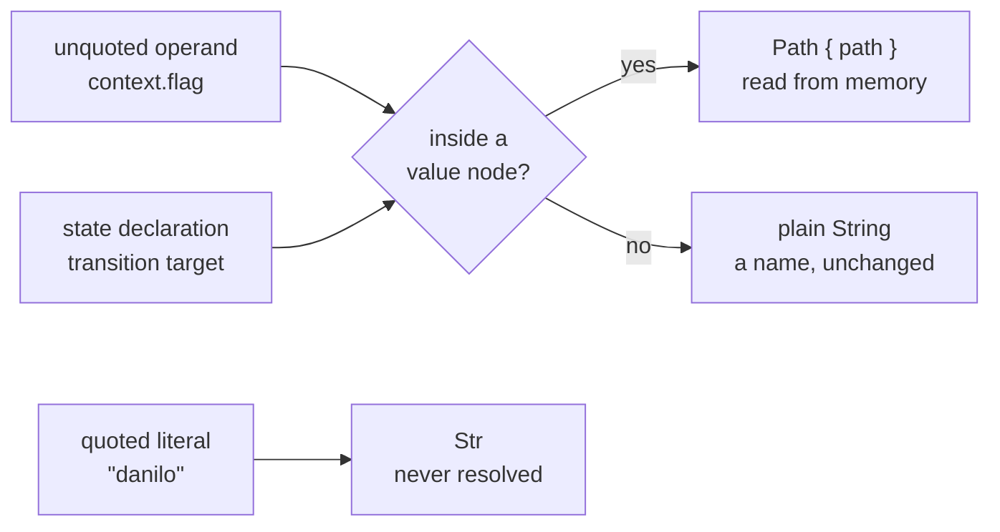

# ADR-DA00-10: A Memory Reference Carries Its Own JSON Shape in the AST

| Field | Value |
|---|---|
| Status | Accepted |
| Date | 2026-08-31 |
| Deciders | Danilo Borges |

---

## Context

`Value` is the AST node for an operand — the two sides of a comparison in an `if`, and the right-hand
side of a `set`. It was declared as an untagged enum over `Str(String)`, `Number(f64)`, `Bool(bool)`,
`Null` and `Path(String)`.

`Str` and `Path` have **identical JSON shapes**: both are a bare string. An untagged enum discriminates
by shape alone, so serde could never select `Path`. The variant was unconstructible, and had been since
it was written — the runtime's match arm for it was dead code.

The loss happened one layer earlier. The grammar draws the distinction cleanly: a literal is
`with_quotes_string`, a reference is `state_name`. The CST→AST mapping collapsed both into the same bare
string, so by the time serde saw the JSON there was nothing left to discriminate on. The grammar knew;
the wire format could not say.

Downstream, the runtime resolves an operand by matching on `Value`. Receiving `Str("session.count")`
where it should have received a reference, it returned the **path text** as a string instead of reading
the store. Five behaviors were wrong as a result, and they are one defect, not five:

| Written | What ran |
|---|---|
| `if context.onboarding == true` | string vs boolean — always false |
| `if session.count > 3` | string vs number — always false |
| `if context.name == "danilo"` | path text vs literal — always false |
| `if context.flag` | a non-empty string is truthy — always true, even for a stored `false` |
| `set context.a = session.b` | wrote the literal text `"session.b"`, and shipped it as an effect |

The fourth row is the workaround the field report recommended for the first. It was broken in the
opposite direction.

DA00-06 designates the AST as the formal single source of truth for the JSON contract, with the
TypeScript types generated from it. Changing that contract is therefore a decision, not an
implementation detail — which is why it is recorded here.

## Decision

We will give a memory reference **its own JSON shape**: `Path` becomes a struct variant serializing as
`{"path": "…"}`, and the CST→AST mapping tags an unquoted operand as it maps it. `Value` becomes:

```typescript
type Value = string | number | boolean | null | { path: string }
```

The tagging is **positional**. It happens inside the grammar's `value` wrapper, which appears only
inside an expression, and an expression appears only as a `set` right-hand side or inside a condition.
The same grammar node also names a state declaration and a `transition to` target; neither passes
through a `value` node, so both keep deserializing as plain strings.



The grammar is not touched.

## Options considered

- **Option A — Reorder the variants, putting `Path` before `Str`.** The obvious move, and impossible:
  both variants hold a `String`, so an untagged enum sees one shape and declaration order decides
  nothing about which *should* win. If it did decide, it would invert the defect — every quoted literal
  would become a memory lookup. Rejected.
- **Option B — Keep the AST lossy and let the runtime guess.** Treat any string containing a dot as a
  reference. Rejected: it makes `"context.foo"` unwritable as a literal, and it pushes syntax knowledge
  into a layer that never sees the syntax tree.
- **Option C — Add a distinct node to the grammar.** It would work, but it regenerates the parser and
  drags in the container-based WASM build for a distinction the grammar **already draws**. The loss is
  entirely in the CST→AST mapping, so that is where it should be repaired. Rejected as
  disproportionate.
- **Option D (chosen) — A struct variant, tagged positionally during the CST→AST mapping.** The object
  shape is unambiguous against every sibling, so variant order stops mattering; the grammar stays
  frozen; and the AST stays pure data, with the decision about *which* operand is a reference made in
  the mapping layer where the tree is still available. The cost is a changed wire contract.

## Consequences

**Easier.** Conditions and `set` now read memory, which is what the language always documented. The
runtime's resolution arm stops being dead code. A reader of the JSON can tell a literal from a
reference without re-deriving it from the source text.

**Harder — this is a breaking wire-contract change.** Any consumer that pattern-matches a condition
operand as a plain string breaks. Nothing in this repository does: the compiler walks only the branch
bodies and never reads a condition, and the language server carries hover text only. The repository
cannot speak for consumers outside it. The generated TypeScript type follows automatically from the
Rust, which means **nobody sees it change in review** — the hand-written contract document is the only
place a reviewer meets it, so that edit is load-bearing rather than cosmetic.

**A silent correction, not a regression.** A behavior written against the old runtime had its truthy
checks firing unconditionally; they now evaluate honestly, and a flow that always took the `then`
branch may now always take the `else` branch. No diagnostic fires. This is the most likely source of a
downstream report, and it is the bug being fixed rather than a new one.

**An unqualified bare word resolves to nothing.** An operand with no domain prefix — `if mode == active`
— is now a reference whose lookup fails, yielding null. Measured before adopting this: such a
comparison was **already false** under the old behavior, because the left side was the path text and
the right side the bare word, and the two never matched. So the observable result does not move. What
moves is the *reason*, and the earlier proposal that a bare word "happens to work today" did not
survive measurement.

**The disjoint-shape invariant is now load-bearing.** This works because `{"path": …}` is the only
object-shaped variant of `Value`. Adding a second object-shaped variant reintroduces exactly the
shadowing this record exists to remove. Anyone extending `Value` is holding that invariant.

**Follow-up, deliberately not taken here.** A lint that flags an unquoted operand with no memory domain
would make the null-resolving case visible instead of silent. It belongs to the compiler, needs its own
diagnostic code, and is out of scope for this change.

## Related

- DA00-06 — the AST as the single source of truth for the JSON contract, which makes this a recorded
  decision rather than a quiet commit.
